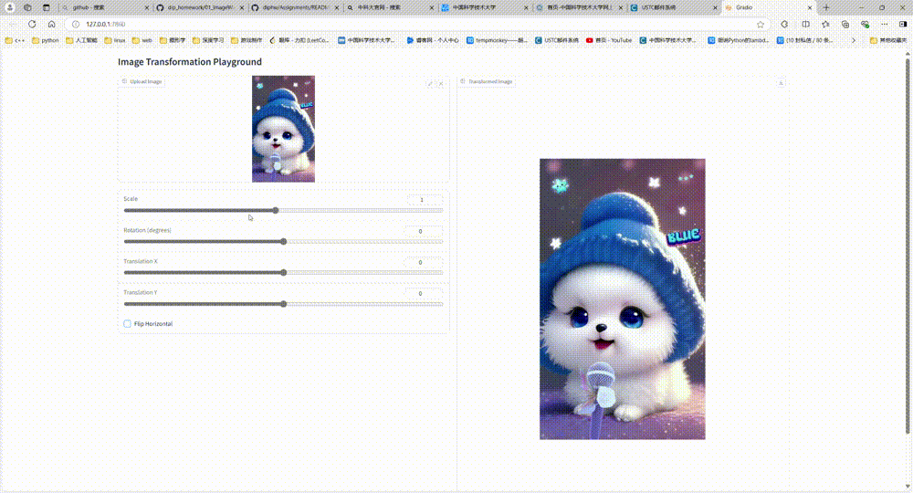
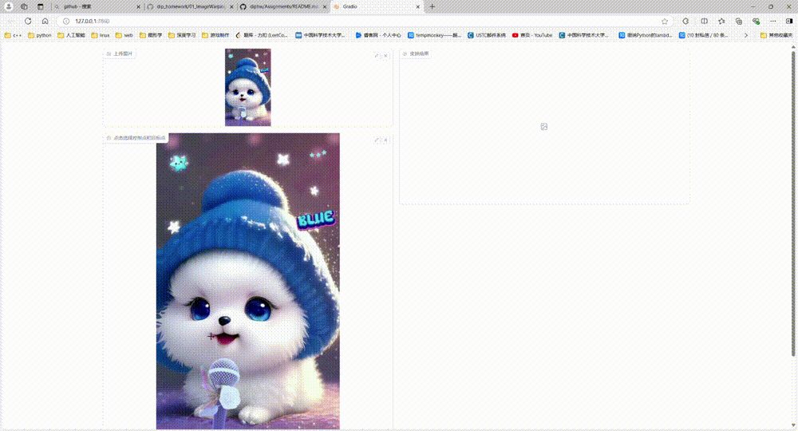
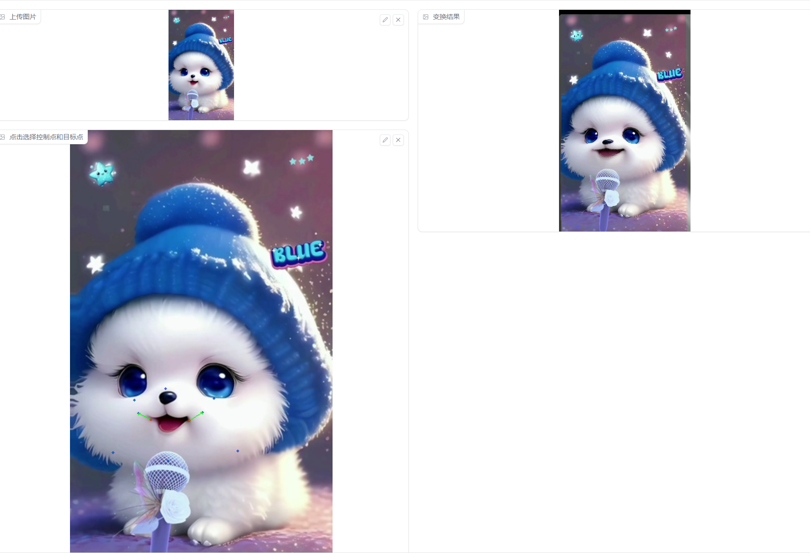

# Assignment 1 - Image Warping


## Implementation of Image Geometric Transformation

This repository is Lebin Zhu's implementation of Assignment_01 of DIP. 
### 1. Basic Image Geometric Transformation (Scale/Rotation/Translation).
Fill the [Missing Part](run_global_transform.py#L21) of 'run_global_transform.py'.
### 2. Point Based Image Deformation.
Implement RBF based image deformation in the [Missing Part](run_point_transform.py#L52) of 'run_point_transform.py'.

And fill the gap caused by warpping.

## Requirements

To install requirements:

```setup
python -m pip install -r requirements.txt
```


## Running

To run basic transformation, run:

```basic
python run_global_transform.py
```

To run point guided transformation, run:

```point
python run_point_transform.py
```

## Results (need add more result images)
### Basic Transformation


### Point Guided Deformation:



## Acknowledgement

>📋 Thanks for the algorithms proposed by [Image Deformation Using Moving Least Squares](https://people.engr.tamu.edu/schaefer/research/mls.pdf).
