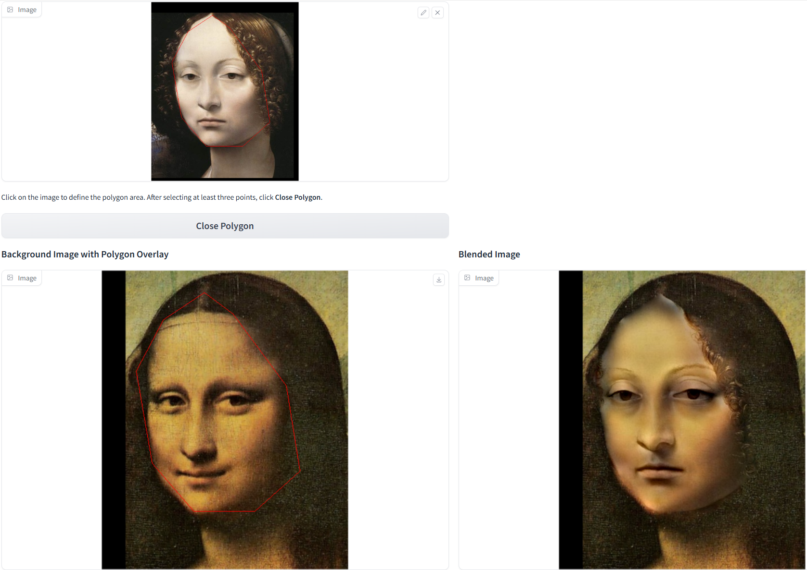
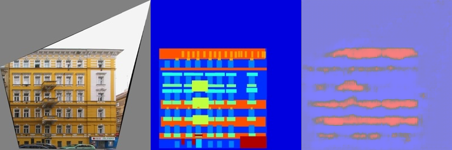

# Assignment 2 - DIP with PyTorch


## Implementation of Image Geometric Transformation

This repository is Lebin Zhu's implementation of Assignment_02 of DIP. 
### 1. Implement Poisson Image Editing with PyTorch.
Fill the [Polygon to Mask function](run_blending_gradio.py#L95) and the [Laplacian Distance Computation](run_blending_gradio.py#L115) of 'run_blending_gradio.py'.


### 2. Pix2Pix implementation.
See [Pix2Pix subfolder](Pix2Pix/).


## Running

To run blending, run:

```basic
run_blending_gradio.py
```

To train the model of Pix2Pix, run:

```point
python Pix2Pix/train.py
```

## Results (need add more result images)
### Blending(It's slow using cpu)


### The train loss of Pix2Pix is still bad, we need to prove our net and download larger dataset.



