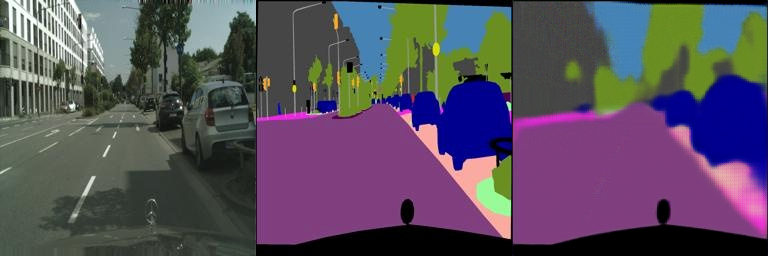
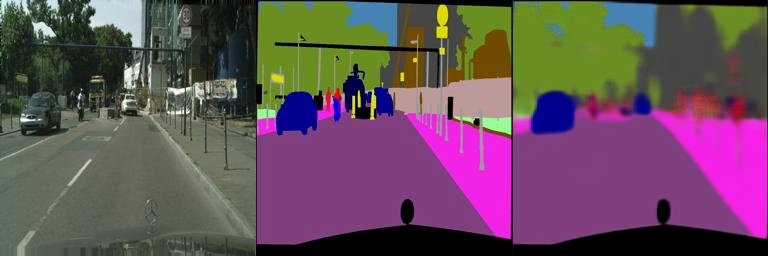
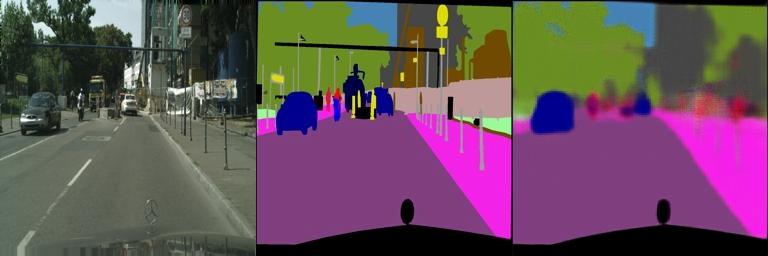
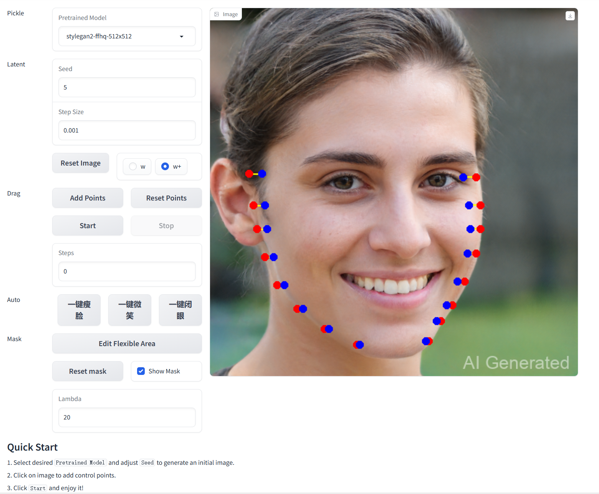
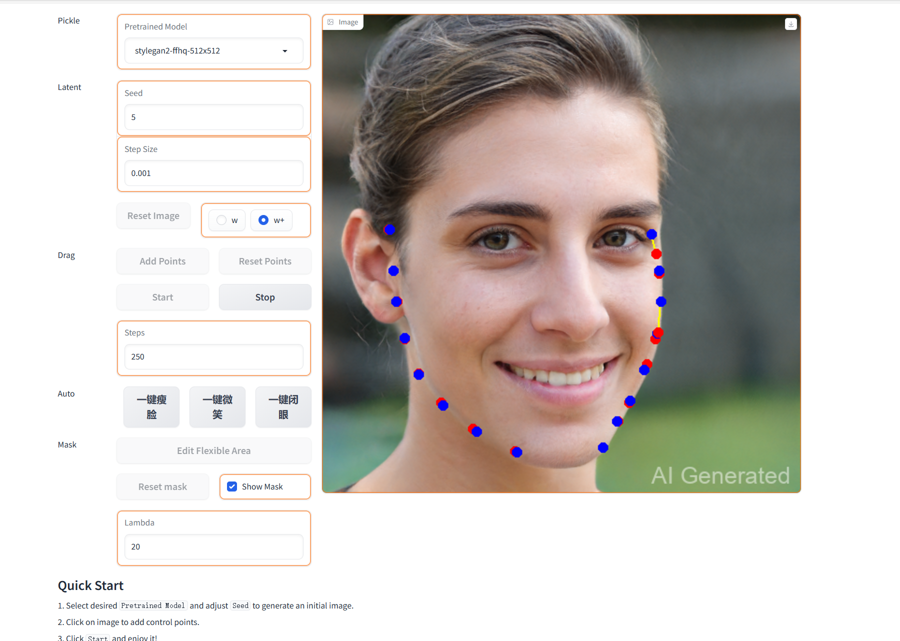
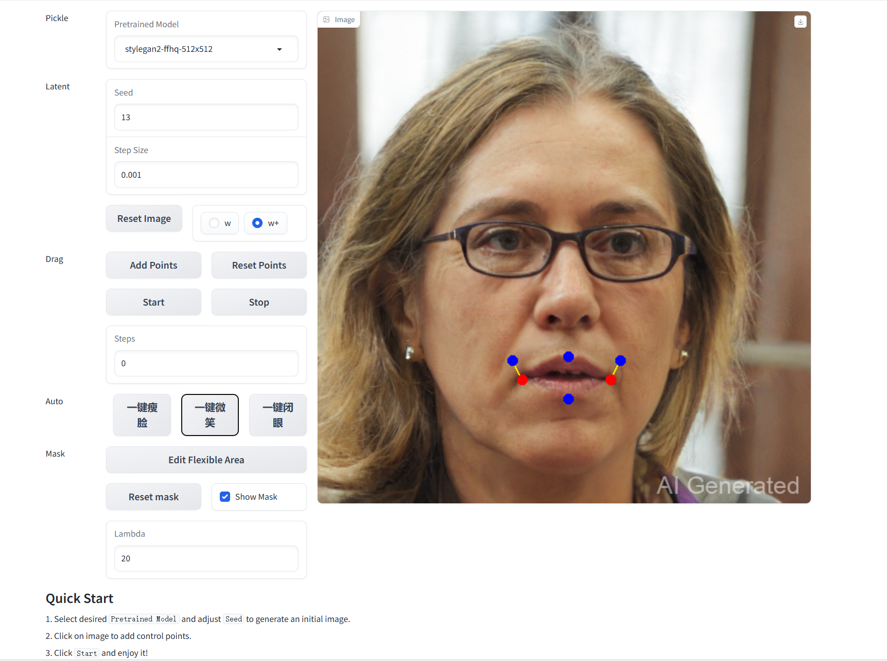
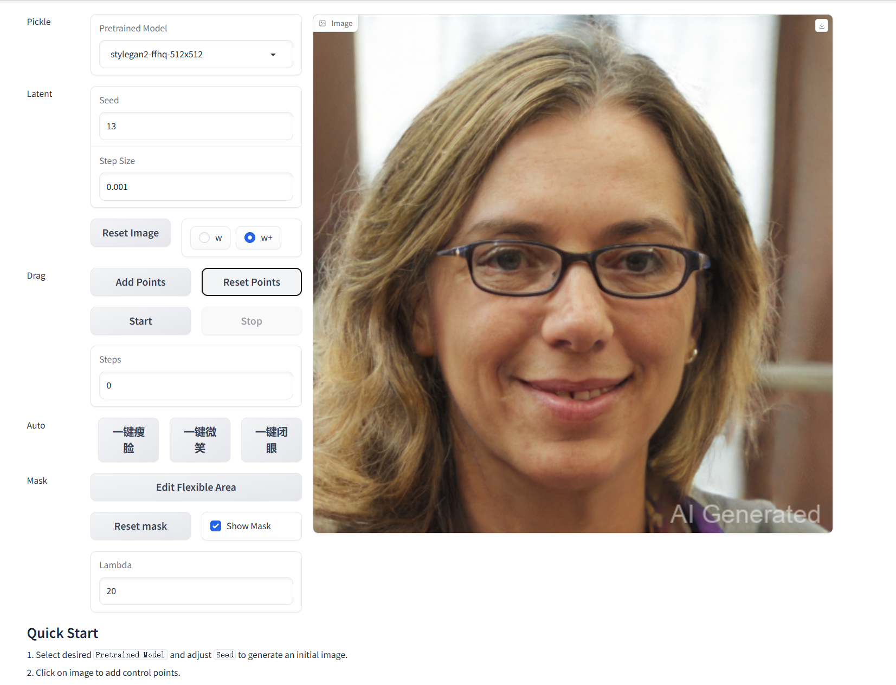
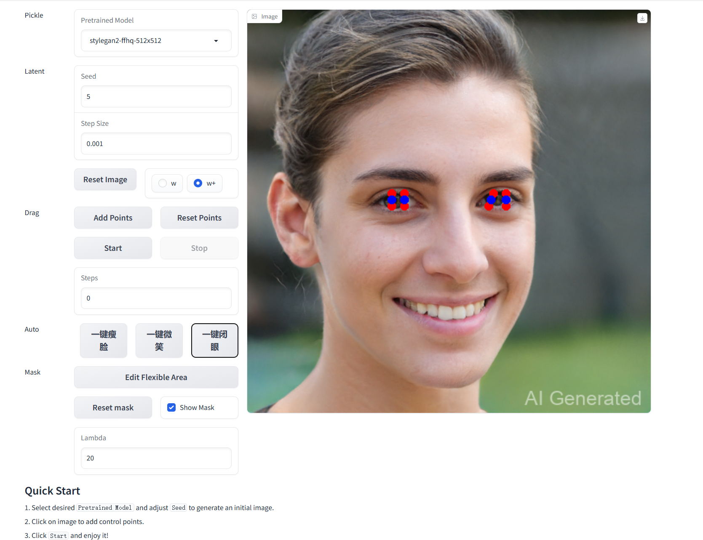
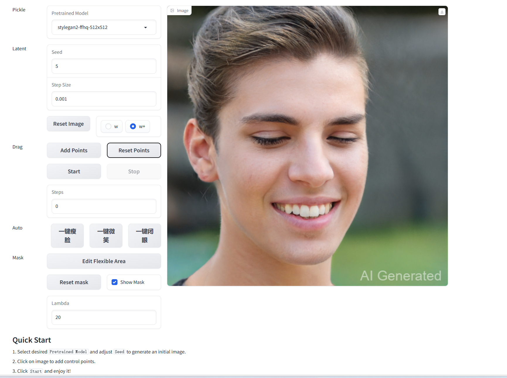

# Assignment 3 - Play with GANs

### In this assignment, you will implement two methods for using GANs in digital image processing.

### Resources:
- [DragGAN](https://vcai.mpi-inf.mpg.de/projects/DragGAN/): [Implementaion 1](https://github.com/XingangPan/DragGAN) & [Implementaion 2](https://github.com/OpenGVLab/DragGAN)
- [Facial Landmarks Detection](https://github.com/1adrianb/face-alignment)

---

\
See [作业03-Play_with_GANs.pptx](https://rec.ustc.edu.cn/share/705bfa50-6e53-11ef-b955-bb76c0fede49) for detailed requirements.

## Task 1: GAN for segmentation
- 实验二做pix2pix时做得比较仓促，这次给网络加了参数提高拟合能力（提升比较明显），并下载了更大的cityscapes数据集，任务为在cityscapes上做语义分割。
我给模型添加了简单的判别器，训练时每个epoch先用生成器生成的假结果和真结果训练判别器，再利用判别器和l1损失训练生成器，这样就实现了cgan的结构。

项目说明

    project-root/ 
    ├── datasets/                   #数据集
    │ ├── facades/ 
    │ └── cityscapes/ 
    │──checkpoints/                 #实验报告图对应的模型参数
    ├── output/                     #存储训练结果
    │ ├── xxxx/                     #某次结果
    │       │──checkpoints/         #模型参数
    |       │──train_results/       #训练集结果图
    |       │──val_results/         #验证集结果图
    |       └──training_log.txt     #记录loss
    │ └── xxxx/
    ├── train_cgan.py               #使用gan loss + l1 loss训练
    ├── train_l1.py                 #只用l1 loss训练
    ├── pix2pix_dataset.py          #数据集读取
    ├── FCN_network2.py             #生成器网络
    └── download_dataset.sh         #下载数据集脚本

下载数据集

    bash download_dataset.sh dataset_name
训练

    python train_cgan.py
    python train_l1.py

### 实验结果：
- 损失函数里面cgan loss与l1 loss的比例可以调整，多次实验对比可以得出cgan损失占比小一些更好，我选择的比例为1：50
- cgan loss的加入相比于纯l1 loss的结果并没有提升，实验结果两者的验证集l1 loss最后结果都是0.10,这一点在pix2pix项目论文里也有提及
- cgan结果

- l1结果

## Task 2: DragGAN for image editing
### 环境配置
- 参考[Implementaion 1](https://github.com/XingangPan/DragGAN)，在linux服务器上配置只需要注意gradio使用3.36.1版本
- 参考[Facial Landmarks Detection](https://github.com/1adrianb/face-alignment)，使用pip安装
- 运行[gragan_modify.py](./draggan/gragan_modify.py),切换模型到人脸模型，点击相应一键功能按键，然后点击start即可。

### 实现方法
- 瘦脸：将脸部轮廓点往中间收缩，实现方法较为粗糙
- 微笑：固定嘴唇中间的上下距，将嘴角往外往上拉
- 闭眼：将上下眼皮的关键点往中间拉

### 实验结果：实现自动瘦脸，微笑和闭眼功能

  
  

  
  

  
  

